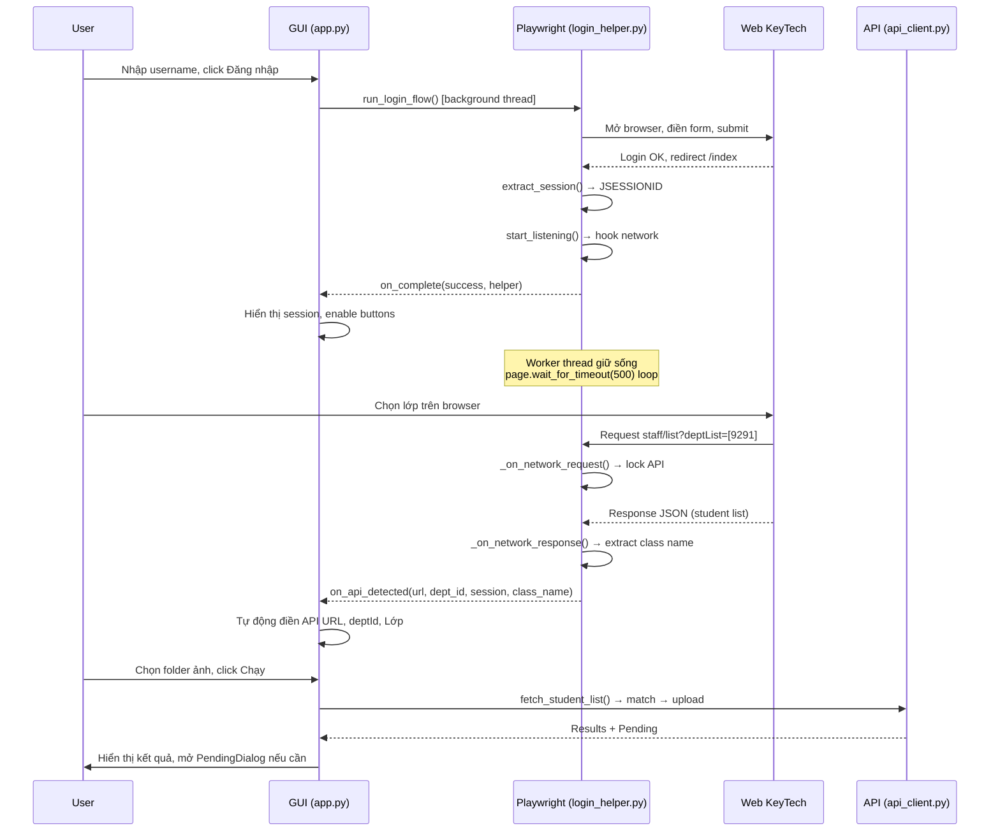

# Face Upload Tool — KeyTech

> Tool desktop tự động upload ảnh khuôn mặt học sinh lên hệ thống quản lý KeyTech.
> Hỗ trợ auto login + tự động phát hiện lớp, hoặc nhập thủ công.

## Mục lục

- [Tổng quan](#tổng-quan)
- [Kiến trúc hệ thống](#kiến-trúc-hệ-thống)
- [Cài đặt](#cài-đặt)
- [Hướng dẫn sử dụng](#hướng-dẫn-sử-dụng)
- [Chi tiết từng module](#chi-tiết-từng-module)
- [Luồng xử lý chi tiết](#luồng-xử-lý-chi-tiết)
- [Cấu trúc API KeyTech](#cấu-trúc-api-keytech)
- [Lưu ý kỹ thuật](#lưu-ý-kỹ-thuật)
- [Troubleshooting](#troubleshooting)

---

## Tổng quan

### Mục đích

Upload hàng loạt ảnh khuôn mặt (`.jpg`/`.jpeg`) cho học sinh lên hệ thống **keytechvietnam.vn**, tự động đối chiếu tên file ảnh với tên học sinh từ API.

### Tính năng chính

| Tính năng | Mô tả |
|---|---|
| **Auto Login** | Tự động đăng nhập qua Playwright browser |
| **Auto API Detect** | Tự bắt API URL khi user chọn lớp trên browser |
| **Auto Class Name** | Tự trích tên lớp từ response API |
| **Smart Name Matching** | Đối chiếu tên file ↔ tên HS qua normalize + suffix matching |
| **2-Phase Upload** | Phase 1: upload an toàn. Phase 2: duyệt match yếu/mơ hồ |
| **Dry Run** | Chế độ kiểm tra không upload thật |
| **Skip Existing** | Bỏ qua HS đã có ảnh |
| **Manual Fallback** | Nhập JSESSIONID + API URL bằng tay nếu auto không dùng được |

---

## Kiến trúc hệ thống

```
┌─────────────────────────────────────────────────────────┐
│                      app.py (GUI)                       │
│   CustomTkinter  ·  FaceUploadApp  ·  PendingDialog     │
├────────────┬────────────┬────────────┬──────────────────┤
│            │            │            │                  │
│  login_    │  api_      │  uploader  │  class_          │
│  helper.py │  client.py │  .py       │  selector.py     │
│            │            │            │                  │
│  Playwright│  requests  │  Phase1/2  │  Validation      │
│  Login     │  HTTP      │  Batch     │  Guess class     │
│  API Detect│  Upload    │  Processing│                  │
├────────────┴────────────┼────────────┴──────────────────┤
│                         │                               │
│      matcher.py         │    name_utils.py              │
│      StudentIndex       │    normalize_name()           │
│      Suffix matching    │    Vietnamese diacritics      │
├─────────────────────────┴───────────────────────────────┤
│                    web_selectors.py                     │
│        CSS selectors + URL patterns cho KeyTech         │
└─────────────────────────────────────────────────────────┘
```

### File structure

```
Tool_UppIMG/
├── app.py              # GUI chính (CustomTkinter), entry point
├── login_helper.py     # Playwright: login, session, network interception
├── api_client.py       # HTTP client: fetch student list, upload face image
├── uploader.py         # Batch processing 2 pha (phase 1 + phase 2)
├── matcher.py          # Đối chiếu tên file ↔ tên HS (StudentIndex)
├── name_utils.py       # Normalize tên tiếng Việt, bỏ dấu, tokenize
├── class_selector.py   # Validation cấu hình lớp, đoán tên lớp từ folder
├── web_selectors.py    # CSS selectors + URL patterns cho web KeyTech
├── test_matcher.py     # Unit tests cho matcher
├── requirements.txt    # Dependencies
└── README.md           # File này
```

---

## Cài đặt

### Yêu cầu

- Python 3.10+
- Windows (đã test trên Windows 10/11)

### Cài dependencies

```bash
pip install -r requirements.txt
```

### Cài Playwright browser (cho auto login)

```bash
playwright install chromium
```

> **Nếu không cài Playwright**: Tool vẫn chạy được ở chế độ thủ công (nhập JSESSIONID + API URL bằng tay).

### Chạy

```bash
python app.py
```

---

## Hướng dẫn sử dụng

### Chế độ 1: Auto Login (khuyên dùng)

1. Nhập **Username** → click **🔐 Đăng nhập**
2. Playwright mở trình duyệt → tự đăng nhập
3. Trên browser, vào **Thông tin sinh viên** → **chọn lớp** cần upload
4. Tool **tự động bắt API** và điền: `API List URL`, `deptId`, `Lớp`
5. Chọn **Folder ảnh** chứa file `.jpg` đặt tên theo tên HS
6. Tick **🔍 Dry Run** để kiểm tra trước → click **▶ Chạy**
7. Xem kết quả → tắt Dry Run → chạy lại để upload thật

### Chế độ 2: Thủ công

1. Click **✋ Thủ công**
2. Nhập thủ công:
   - **JSESSIONID**: Lấy từ browser DevTools → Application → Cookies
   - **API List URL**: Lấy từ DevTools → Network → request `list?staffType=S&deptList=...`
3. Tiếp tục từ bước 5 như trên

### Chuyển lớp

- Click **🔄 Detect lại lớp** → chọn lớp mới trên browser → tool tự bắt API mới
- Các trường `Lớp`, `API URL`, `deptId` sẽ tự cập nhật

---

## Chi tiết từng module

### `app.py` — GUI chính

**Class `FaceUploadApp`** (kế thừa `ctk.CTk`):

| Phần UI | Mô tả |
|---|---|
| **Khối A: Login** | Username + nút Đăng nhập / Thủ công / Đóng browser |
| **Khối B: Cấu hình** | Base URL, JSESSIONID, Lớp, API URL, Face End Date, Folder ảnh, options |
| **Khối C: Log** | Textbox realtime log + stats bar |

**Luồng callback quan trọng**:

- `_on_login()` → gọi `run_login_flow()` trên background thread
- `_on_login_complete()` → nhận session, enable các nút
- `_on_api_auto_detected()` → callback từ Playwright thread khi detect API → dùng `self.after(0, ...)` để cập nhật UI an toàn trên main thread
- `_on_start()` → validate → chạy `_run_phase1()` trên background thread
- `_on_phase1_complete()` → mở `PendingReviewDialog` nếu có pending

**Class `PendingReviewDialog`** (kế thừa `ctk.CTkToplevel`):

- Hiển thị danh sách match yếu (checkbox) và match mơ hồ (combobox)
- User duyệt xong → gọi callback `_on_pending_confirmed()` → chạy Phase 2

---

### `login_helper.py` — Browser automation

**Class `LoginHelper`**:

Quản lý toàn bộ lifecycle của Playwright browser.

| Method | Mô tả |
|---|---|
| `open_browser()` | Mở Chromium, hook network events, navigate đến login |
| `fill_and_login()` | Điền form login, submit |
| `wait_for_login_result()` | Chờ redirect, kiểm tra URL |
| `extract_session()` | Đọc JSESSIONID từ cookies (chỉ gọi trên Playwright thread) |
| `start_listening()` | Bật network interception |
| `reset_detection()` | Reset để detect lớp khác |
| `close_browser()` | Cleanup + signal worker thread thoát |

**Network Interception** (2 handler):

1. **`_on_network_request(request)`** — Bắt request `staff/list` có `deptList`:
   - Filter: URL chứa `staff/list` + `deptList` + đúng 1 dept ID
   - Khi match: lock API, trích JSESSIONID từ request Cookie header (thread-safe)

2. **`_on_network_response(response)`** — Bắt response tương ứng:
   - Parse JSON body → trích `deptName` từ student record đầu tiên → class name
   - Gọi callback `on_api_detected(api_url, dept_id, jsessionid, class_name)`

**`run_login_flow()`** — Factory function:

- Tạo `LoginHelper`, chạy login trên background thread
- **Quan trọng**: Sau login, worker thread giữ sống bằng vòng lặp `page.wait_for_timeout(500)` để Playwright event loop tiếp tục dispatch network events. Thread thoát khi `close_browser()` signal qua `_browser_closed_event`.

**⚠ Threading constraints**:

```
Playwright thread (worker)     Tkinter main thread (GUI)
─────────────────────────      ────────────────────────
✅ Playwright API calls         ❌ KHÔNG gọi Playwright API
✅ Network event handlers        ✅ Tkinter UI updates
✅ page.wait_for_timeout()      ✅ self.after(0, callback)
```

---

### `api_client.py` — HTTP client

| Function | Mô tả |
|---|---|
| `fetch_student_list(api_url, jsessionid)` | GET danh sách HS, auto-adjust limit=500. Parse response linh hoạt (tìm list trong `rows`, `data`, `list`, ...) |
| `upload_face_image(base_url, jsessionid, staff_id, image_path, face_end_date)` | POST multipart upload ảnh lên `/ent/ent/staffface/save` |
| `test_connection(base_url, jsessionid)` | Test session còn sống không |

**Retry logic**: Tự động retry 2 lần khi `ConnectionError` / `Timeout`, delay 2s giữa các lần.

**Custom exceptions**: `SessionExpiredError`, `APIError`

---

### `uploader.py` — Batch processing

**2 pha xử lý**:

#### Phase 1: `process_phase1()`

```
Scan folder ảnh → Fetch student list → Build index → Match từng file
                                                          │
                          ┌───────────┬──────────┬────────┴────────┐
                          │           │          │                 │
                       Exact/     Weak match   Ambiguous       Not found
                       Safe suffix  (1 token)   (>1 candidate)
                          │           │          │
                       Upload/     → pending    → pending
                       Dry run       (Phase 2)    (Phase 2)
```

- **Safe rules**: `exact_full_name`, `suffix_N_unique` (N ≥ 2) → upload tự động
- **Weak rules**: `suffix_1_unique` → đưa vào pending, chờ user xác nhận
- **Ambiguous**: nhiều HS trùng → đưa vào pending, user chọn đúng người

#### Phase 2: `process_phase2()`

- Xử lý các pending items đã được user duyệt qua `PendingReviewDialog`
- Upload hoặc dry run cho từng item đã chọn

---

### `matcher.py` — Name matching engine

**Class `StudentIndex`**:

Xây index 2 tầng từ danh sách HS:

1. **`exact_index`**: `normalized_full_name → [students]`
2. **`suffix_index`**: `suffix_tokens → [students]` (từ 1 token đến N-1 token)

**Ví dụ**: Học sinh "Nguyễn Văn An" → normalize = `"nguyen van an"`

```
exact_index:  "nguyen van an" → [student]
suffix_index: "van an"        → [student]   (suffix 2 token)
              "an"            → [student]   (suffix 1 token)
```

**`match(file_norm_name)`** — Priority:
1. Exact full-name → `exact_full_name`
2. Suffix match (unique) → `suffix_N_unique`
3. Suffix match (>1 result) → `ambiguous`
4. Không match → `not_found`

---

### `name_utils.py` — Vietnamese name normalization

**`normalize_name(raw)`**:

```
"Nguyễn Văn An (1).jpg"
  → bỏ extension     → "Nguyễn Văn An (1)"
  → NFC normalize    → "Nguyễn Văn An (1)"
  → lowercase        → "nguyễn văn an (1)"
  → bỏ dấu tiếng Việt → "nguyen van an (1)"
  → bỏ suffix trùng   → "nguyen van an"
  → gộp spaces       → "nguyen van an"
```

**Xử lý đặc biệt**:
- `đ/Đ` → `d/D`
- Bỏ dấu bằng 2 bước: translate map + NFD decompose
- Bỏ hậu tố file trùng: `(1)`, `_2`, `-copy`, `- Copy`

---

### `class_selector.py` — Validation & utilities

| Function | Mô tả |
|---|---|
| `validate_class_config()` | Kiểm tra lớp, API URL, folder nhất quán |
| `guess_class_from_folder()` | Đoán tên lớp từ tên folder (VD: `D:\Anh\6A1` → `6A1`) |
| `count_images_in_folder()` | Đếm file `.jpg`/`.jpeg` |

---

### `web_selectors.py` — CSS selectors & URL patterns

Tập trung tất cả CSS selectors và URL patterns cho web KeyTech. Khi web thay đổi HTML, **chỉ cần sửa file này**.

```python
LOGIN_SELECTORS = {
    'username': ['#username', ...],
    'password': ['#password', ...],
    'captcha':  ['#captcha', ...],
    'submit':   ['#login', ...],
}
STUDENT_LIST_URL_PATTERN = 'staffType=S'      # Nhận diện request student list
STUDENT_LIST_URL_CONTAINS = 'deptList'         # Phải có deptList = đã chọn lớp
```

---

## Luồng xử lý chi tiết

### Auto Login + Upload Flow



---

## Cấu trúc API KeyTech

### Endpoint

| API | Method | URL |
|---|---|---|
| Student List | GET | `{base}/ent/ent/staff/list?staffType=S&deptList=[{id}]&limit=500&page=1` |
| Upload Face | POST | `{base}/ent/ent/staffface/save` (multipart) |
| Test Connection | GET | `{base}/ent/ent/staff/list?limit=1&page=1&staffType=S` |

### Authentication

- Cookie-based: `JSESSIONID`
- Session hết hạn → HTTP 401/403 hoặc redirect về `/web/login.html`

### Student Record (JSON response)

```json
{
  "rows": [
    {
      "id": 32191,
      "staffName": "Đỗ Thị Bảo An",
      "staffCode": "...",
      "deptName": "Lớp 7A4",
      "staffPhoto": "",
      "staffFaceId": null
    }
  ]
}
```

Các trường quan trọng:
- `id` — Staff ID, dùng cho upload
- `staffName` — Tên đầy đủ, dùng cho matching
- `deptName` — Tên lớp/phòng ban
- `staffPhoto`, `staffFaceId` — Kiểm tra đã có ảnh chưa

### Upload Face (POST multipart)

```
POST /ent/ent/staffface/save
Content-Type: multipart/form-data

Fields:
  staffId: "32191"
  faceEndDate: "2029-12-31"
  imageFile: (binary JPEG)
```

---

## Lưu ý kỹ thuật

### Threading Model

Tool sử dụng 3 loại thread:

| Thread | Vai trò | Lưu ý |
|---|---|---|
| **Main (Tkinter)** | UI rendering, event handling | Không gọi Playwright API |
| **Playwright Worker** | Login, network interception | Giữ sống bằng `wait_for_timeout()` loop |
| **Upload Worker** | Phase 1/2 batch processing | Daemon thread, giao tiếp qua `self.after()` |

### Playwright Event Loop

Playwright sync API dùng greenlet nội bộ. Event chỉ được dispatch khi Playwright đang thực thi API call. Nếu thread bị block bởi `threading.Event.wait()` hoặc `time.sleep()`, **không có event nào được dispatch**.

**Giải pháp**: Dùng `page.wait_for_timeout(500)` trong vòng lặp — vừa chờ, vừa pump event loop.

### Cross-Thread UI Updates

Mọi cập nhật UI từ background thread phải dùng `self.after(0, callback)` để schedule lên Tkinter main thread. Gọi trực tiếp Tkinter widget từ background thread sẽ gây race condition.

### Session Extraction (Thread-Safe)

JSESSIONID được trích từ **request Cookie header** trong `_on_network_request()` — chạy trên Playwright thread, hoàn toàn thread-safe. Không gọi `context.cookies()` từ GUI thread (sẽ crash do greenlet).

---

## Troubleshooting

| Lỗi | Nguyên nhân | Giải pháp |
|---|---|---|
| `greenlet.error: cannot switch to a different thread` | Gọi Playwright API từ Tkinter thread | Chỉ gọi Playwright API từ worker thread |
| Tool không bắt được API khi chọn lớp | Playwright event loop không chạy | Đảm bảo worker thread dùng `wait_for_timeout()` thay vì `Event.wait()` |
| `SessionExpiredError` | Cookie JSESSIONID hết hạn | Login lại hoặc copy session mới |
| Không match được tên HS | Tên file khác tên trên hệ thống | Kiểm tra normalize: bỏ dấu, lowercase, bỏ extension |
| `Playwright chưa cài` | Thiếu playwright package | `pip install playwright && playwright install chromium` |
| API trả về 401/403 | Session invalid | Đăng nhập lại |
| Upload fail nhưng dry run OK | Session expire giữa chừng | Chạy Test kết nối trước khi upload thật |

---

## Dependencies

```
requests>=2.28.0        # HTTP client cho API calls
customtkinter>=5.2.0    # Modern Tkinter UI
playwright>=1.40.0      # Browser automation (optional - cho auto login)
```
"# Tool_UppIMG---Keytech"  
